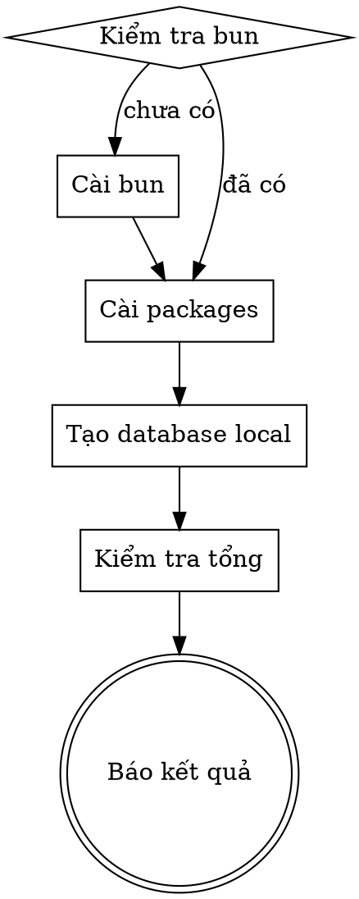

# Setup — Cài đặt mọi thứ để chạy app

Skill này giúp user non-tech cài đặt toàn bộ công cụ cần thiết để chạy app trên máy. Chạy lại lần 2+ chỉ cài thêm phần thiếu, không ảnh hưởng phần đã có.

**Ngôn ngữ:** Luôn nói chuyện bằng tiếng Việt, giọng thân thiện. KHÔNG dùng thuật ngữ kỹ thuật. Xem CLAUDE.md phần "Output Style" để biết cách giao tiếp.

## Quy trình

Chạy tuần tự từng bước. Mỗi bước: kiểm tra trước → chỉ cài nếu thiếu → xác nhận kết quả.



## Bước 1 — Kiểm tra & cài bun

```bash
# Kiểm tra
bun --version
```

Nếu `command not found`:

```bash
# macOS: cài qua curl
curl -fsSL https://bun.sh/install | bash
# Mở terminal mới, hoặc chạy:
export PATH="$HOME/.bun/bin:$PATH"
```

Xác nhận: `bun --version` phải ra số phiên bản.

Nói với user: "Mình vừa cài xong một công cụ cần thiết để chạy app."

## Bước 2 — Cài packages

```bash
cd <project-root>
bun install
```

Project dùng Bun workspaces — một lệnh `bun install` duy nhất ở thư mục gốc sẽ cài TẤT CẢ packages cho cả server và giao diện. Không cần chạy `bun install` riêng trong `fe/` hay `be/`.

Nếu `bun.lock` đã có và `node_modules` đã đầy đủ, bun sẽ tự skip — an toàn khi chạy lại.

**Lưu ý:** FE dùng `vite-plus` (lệnh `vp`) thay vì `vite` thường. Không cần cài gì thêm — `bun install` sẽ lo hết.

Nói với user: "Đang cài đặt các phần cần thiết cho app..."

## Bước 3 — Tạo database trên máy

```bash
cd <project-root>
bun run db:migrate
```

Lệnh này tạo cơ sở dữ liệu local để app lưu trữ dữ liệu khi chạy thử. Nếu database đã có, lệnh sẽ chỉ thêm phần mới (nếu có) — an toàn khi chạy lại.

Nói với user: "Mình đang chuẩn bị chỗ lưu dữ liệu cho app..."

## Bước 4 — Kiểm tra tổng

Chạy kiểm tra nhanh để đảm bảo mọi thứ hoạt động:

```bash
cd <project-root>

# Kiểm tra các công cụ đã cài
bun --version && echo "✓ bun"
bunx wrangler --version && echo "✓ wrangler"
bunx --cwd fe vp --version 2>/dev/null && echo "✓ vite-plus" || (cd fe && npx vp --version 2>/dev/null && echo "✓ vite-plus" || echo "⚠ vite-plus chưa xác nhận được (có thể vẫn hoạt động)")
```

Nếu tất cả đều có ✓ → báo user thành công.

## Báo kết quả

**Khi thành công:**

> Mọi thứ đã sẵn sàng! Bạn có thể chạy app bằng cách nói "chạy app" hoặc "mở app lên xem thử".

**Khi có lỗi:**

Tự xử lý lỗi nếu được. Chỉ hỏi user khi thực sự cần (ví dụ: cần mật khẩu admin máy Mac). Mô tả lỗi bằng ngôn ngữ đơn giản, KHÔNG paste log lỗi.

## Xử lý lỗi thường gặp

| Triệu chứng | Nguyên nhân | Cách xử lý |
|---|---|---|
| `command not found: bun` | Chưa cài bun | Chạy lại Bước 1 |
| `no such table` | Chưa tạo database | Chạy lại Bước 3 |
| `MODULE_NOT_FOUND` | Chưa cài packages | Chạy lại Bước 2 |
| `EACCES permission denied` | Thiếu quyền thư mục | `sudo chown -R $(whoami) ~/.bun` |
| `network timeout` khi cài | Mạng chậm/mất | Thử lại, kiểm tra mạng |

## Gotchas

- **bun cài xong nhưng vẫn `command not found`**: Shell chưa nhận ra bun mới cài. Mở terminal mới hoặc chạy `export PATH="$HOME/.bun/bin:$PATH"` rồi thử lại.
- **`vite-plus` khác với `vite` thường**: FE dùng `vite-plus` với lệnh `vp` thay vì `vite`. Package.json có `overrides` để alias `vite` → `@voidzero-dev/vite-plus-core`. Đừng cài `vite` riêng.
- **`bun install` lỗi với packages native (sharp, canvas...)**: Một số packages cần compiler trên máy. Trên macOS chạy `xcode-select --install` trước.
- **Nhiều version Node/bun cùng tồn tại**: Nếu máy đã có `nvm` hoặc `fnm`, bun và node có thể conflict. Ưu tiên dùng bun cho project này.

## Lưu ý quan trọng

- Skill này KHÔNG bao gồm deploy (đưa app lên mạng). Dùng `/release` cho việc đó.
- Mỗi lần chạy `/setup` đều an toàn — chỉ cài thêm phần thiếu, không xoá hay ghi đè gì.
- Nếu user nói "chạy app" hay "mở app" mà chưa setup, hãy chạy setup trước rồi mới chạy app.
